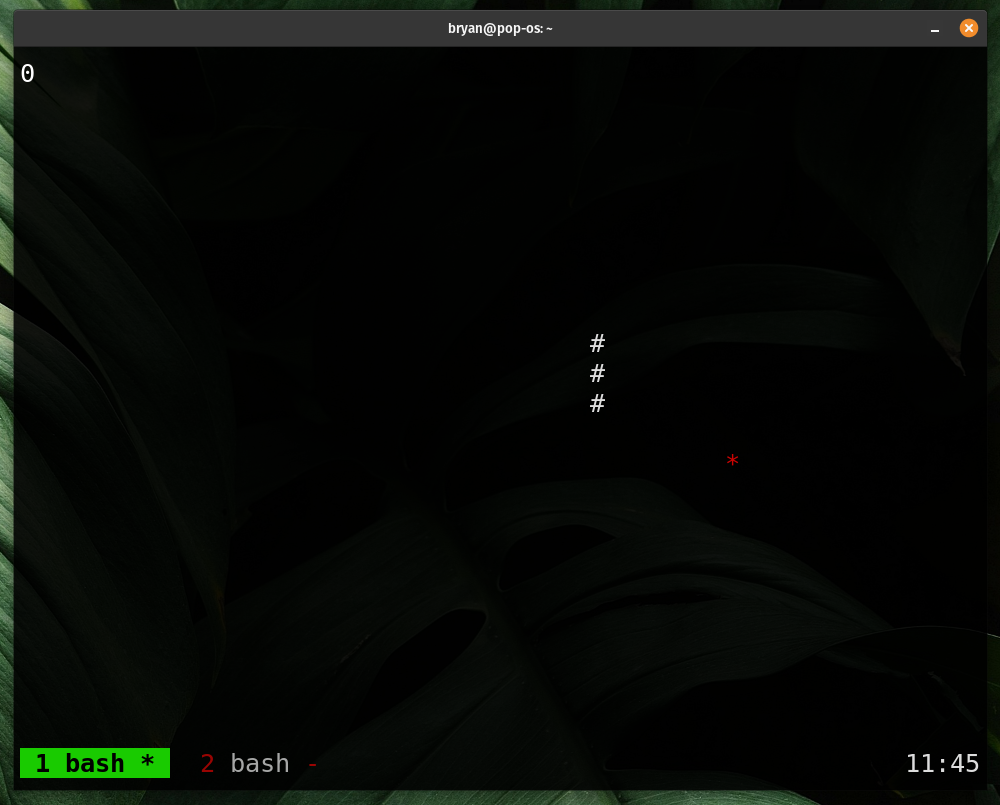

# 🐍 Terminal Snake Game [](https://rust-lang.org)

A classic Snake game implementation in Rust, running directly in your terminal! Perfect for both nostalgia and learning Rust basics.



## Features �
- 🕹️ Classic snake gameplay mechanics
- 🎨 Colored terminal UI
- 📈 Score tracking system
- 💥 Collision detection (walls & self)
- 📊 Game over screen with final score
- 🖥️ Cross-platform terminal support

## Installation ⚙️

### Prerequisites
- [Rust](https://www.rust-lang.org/tools/install) (1.60+)
- Cargo (comes with Rust installation)
- Terminal with UTF-8 support

### Running the Game
1. Clone the repository:
   ```bash
   git clone https://github.com/Bryan07312002/snake-game-terminal.git
   ```
2. Navigate to project directory:
   ```bash
   cd snake-game-terminal
   ```
3. Run the game:
   ```bash
   cargo run --release
   ```

## Controls 🎮
- **Arrow Keys**: Move direction
- **CTRL-Q**: Quit game immediately
- **R**: Restart after game over

```rust
SNAKE_CHAR = '#';
FOOD_CHAR = '*';
```

## Dependencies 📦
This project uses:
- [termion](https://crates.io/crates/termion) - Terminal manipulation
- [rand](https://crates.io/crates/rand) - Random number generation

---

*Created for fun and Rust learning purposes - feedbacks are welcome!*
